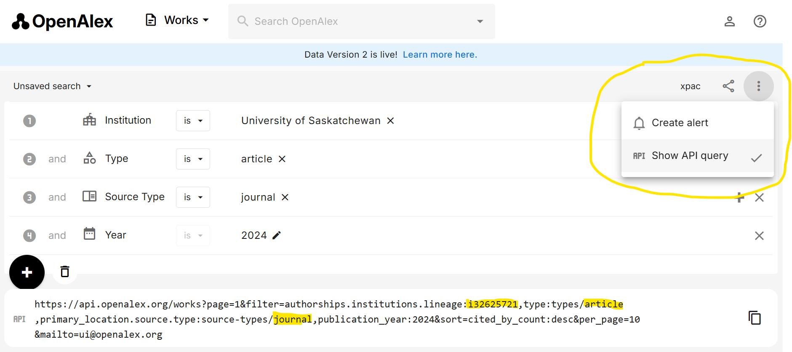

This is R code designed to query the [OpenAlex](https://openalex.org/) [API](https://docs.openalex.org/)
and retrieve institutional research outputs. It then takes those outputs and converts it to an Excel file for ease of use.

This code is inspired by the code developed by Teresa Schultz for her FSCI 2025 Workshop available here: (https://github.com/schauch/OpenAlexRFSCI2025).

I am *NOT* an R coder. This code represents my attempt to try to solve two problems with the OpenAlex web interface:
1. That OpenAlex often doesn't play nice with Excel.
2. That it takes a fire hose approach that can require removing a lot of columns depending on your needs.

If you are an R coder, or just someone who knows more about R than I do, I welcome any feedback you have.

I also want to acknowledge and thank the wonderful people at [OpenAlex](https://openalex.org/team) and the [openalexR project](https://docs.ropensci.org/openalexR/).

<h2>Getting Started</h2>

I wrote this code so that hopefully it can be used without any specific R knowledge or coding skills. The idea is that by replacing a few variables at the top, you'll be able to get a useful Excel file.

For the basics of getting started, this [guide](https://rstudio-education.github.io/hopr/starting.html) may be helpful.

First off, you'll need to install [R](https://cran.r-project.org/).

You'll need software to edit and run code. I recommend (and use) the free and open source [RStudio](https://posit.co/products/open-source/rstudio/?sid=1).

The main file is BaseOpenAlexQuery.R. There is a similar, experimental file called CorrespondingInstitutionOpenAlexQuery.R. However, I do *NOT* recommend using this file other than as a comparison, because OpenAlex [corresponding author data](https://docs.openalex.org/api-entities/works/work-object/authorship-object#is_corresponding) is not reliable.

The code should do this for you (lines 4-6), but you'll also need to install 3 packages:
[openalexR](https://github.com/ropensci/openalexR)
[tidayverse](https://tidyverse.org/)
[openxlsx2](https://janmarvin.github.io/openxlsx2/)

**Important**
On line 13, you'll need to enter your email address to use the OpenAlex [polite pool](https://docs.openalex.org/how-to-use-the-api/rate-limits-and-authentication#the-polite-pool). 

options(openalexR.mailto = "youremailaddress@goeshere.com")

This code does not support API key access.

The main query code is on lines 16-21:

#Query String: Modify the variables below to adjust query  
QueryEntity = "works" #Entity  
QueryInstitution_OpenAlex_ID = "I32625721" #OpenAlex Institution ID is University of Saskatchewan. Must use capital I for filters to work.  
QueryType = "article" #Type  
QuerySourceType = "journal" #Source Type  
QueryStartDate = "2024-01-01" #Publication Start Date  
QueryEndDate = "2024-12-31" #Publication End Date

This code will only work with the [works entity](https://docs.openalex.org/api-entities/works).

In order to design your query, the easiest way is to use the OpenAlex web interface, copy the API link, and paste the relevant components into the appropriate fields. For the [default example](https://openalex.org/works?page=1&filter=authorships.institutions.lineage:i32625721,type:types/article,primary_location.source.type:source-types/journal,publication_year:2024) above,
click on the three dots and select "Show API query". You can then replace the sample ID above with your institution's ID. **Please note, you must capitalize the i in the institutional identifier for the code to work.

You can also modify the type and source type (or remove them) if you don't want to use the defaults.

Once that's done you're ready to run the code.

The final Excel file is labeled "Dataset.xlsx" and will be located in a directory based on the timestamp.

If everything works, there will be a message at the end indicating "The code successfully completed."

The Excel file consists of 14 worksheets:

1.  Guide: A listing of all of the worksheets  
2.  Query:	Query Information (includes warnings for articles with more than 100 authors)  
3.  Works: All institutional Works
4.  OAWorks: All open access Works
5.  GoldHybrid:	All gold and hybrid institutional Works (as defined by OpenAlex) https://docs.openalex.org/api-entities/works/work-object#oa_status  
6.  AllAuthors:	All authors for all institutional works  
7.  AllAffiliations:	All affiliations for all authors for all institutional works  
8.  InstAuthors:	All affiliated authors for the institution for all works  
9.  InstAuthorsGoldHybrid:	All affiliated authors for the institutional for Gold and Hybrid works  
10. Corresponding:	All corresponding authors for all works Note: This data is a work in progress https://docs.openalex.org/api-entities/works/work-object/authorship-object#is_corresponding  
11. InstCorresponding:	All corresponding authors affiliated with the institution for all works  
12. InstCorrespondingGoldHybrid:	All corresponding authors affiliated with the institution for all Gold and Hybrid works  
13. APCs:	All list and 'paid' APC data for all institutional works Note: 'paid' APC data often uses list price: https://docs.openalex.org/api-entities/works/work-object#apc_paid  
14. GoldHybridAPCs:	All list and 'paid' APC data for all gold and hybrid works Note: 'paid' APC data often uses list price: https://docs.openalex.org/api-entities/works/work-object#apc_paid  

<h2>For more advanced users:</h2>

There is a filter string to remove columns in lines 62-82. Those columns can be commented out or removed to add additional columns to the Excel file. Where there is only one variable for the column, they should be integrated into the Excel file without issue. Where there are multiple variables for the column/field, openxlsx2 will attempt to format the json to work with Excel, but the results may be messy or the code may fail entirely.

The code in this repository is Copyright Jason Friedmen, licensed under the MIT License.
